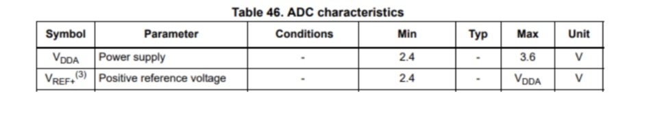
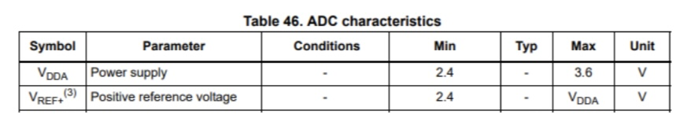
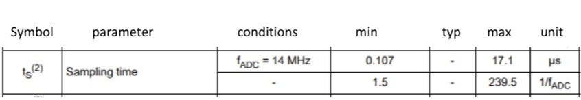
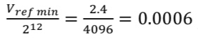

# STM32_ADC
An implementation of an ARM analog to digital converter

A sine voltage source is connected to a micro controller, along with a 'Read' push button. When the push button is pushed, the ADC gets a sample from the voltage, and prints the binary output along with the voltage value on a LCD display connected to the micro-controller.

The correspondig ciruit is tested in Proteous.

Some important features of the micro-controller to pay attention to:

The minimum and maximum values of the VDDA for the converter are as follows:

The minimum and maximum values of the VREF for the converter are as follows:

The sampling time of the converter:

The resolution of the ADC considering the fact that it has 12-bit converters:

